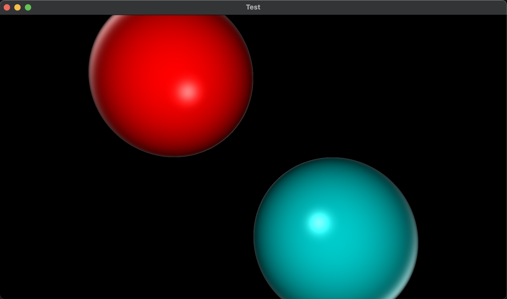

# Ray Traycer

## Introduction

This is simple ray traycer ca that uses SFML library for visualization.



## Build

Before cloning, make sure SFML is installed.

```
git clone https://github.com/kefirRzevo/RayTraycing.git
cd RayTraycing
mkdir obj
make
./app
